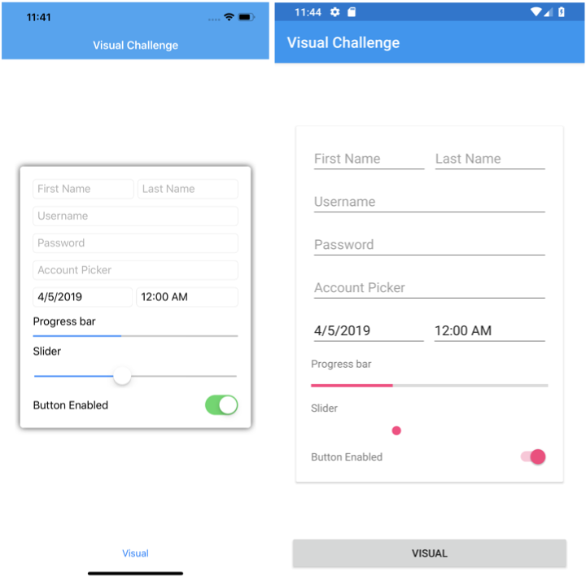
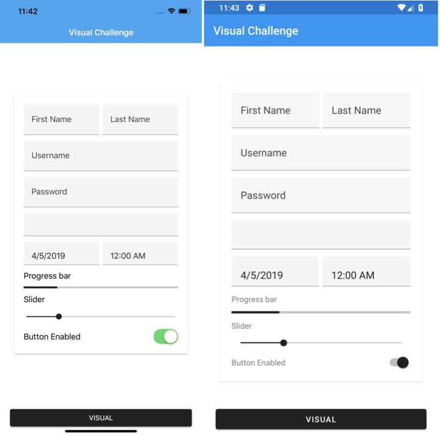

# Visual Challenge

To take a single page design from a previous project that should look the same on iOS and Android, and attempt to recreate it using the latest Visual feature of Xamarin.Forms.

# Results

## Before

## After

## VISUAL Feedback
* Look nice. Will save a ton of custom control and custom styles out of the box.
* Interested in how we can roll out our own `VisualMarker` to handle app-wide theme/styles.
* It will be nice to have a way to set `Visual` app-wide.
* If introducing `Visual` to existing app, steps to the required package are not clear. Maybe a warning/error can be thrown if we set `Visual` but the Visual NuGet package is not installed or referenced.

### Issues !?
* `Frame` does not honor `CornerRadius` in Material.
* `Picker` does not show `Title` in Material.
* `Switch` does not change apperance in Material on iOS.
