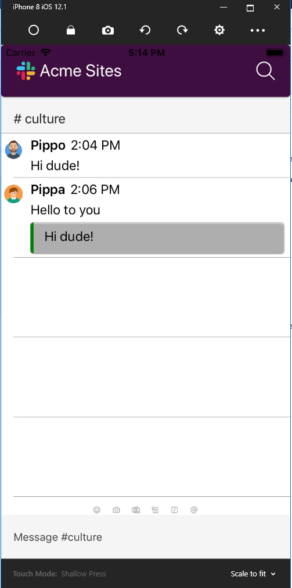

# Visual Challenge

## Description

Tried to reply the chat page of slack.

## what went well

Nice and easy to integrate it. Great 

## what didn't

The layout was left to the developer. I would have liked a more twitter-bootstrap layout to easily place objects in the page.
I had to work with margin/padding manually.
Listview has no _Visual_ padding for example.

## what you would like to see us doing differently in support of this goal: same design on iOS and Android

Master/detail page?